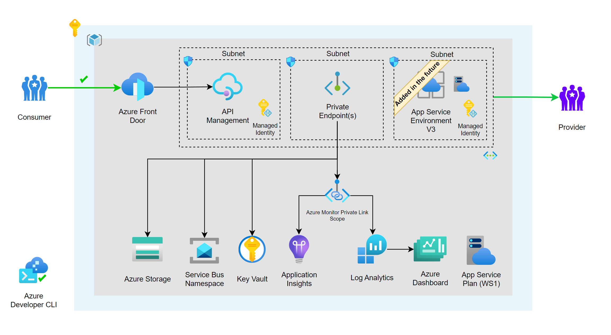
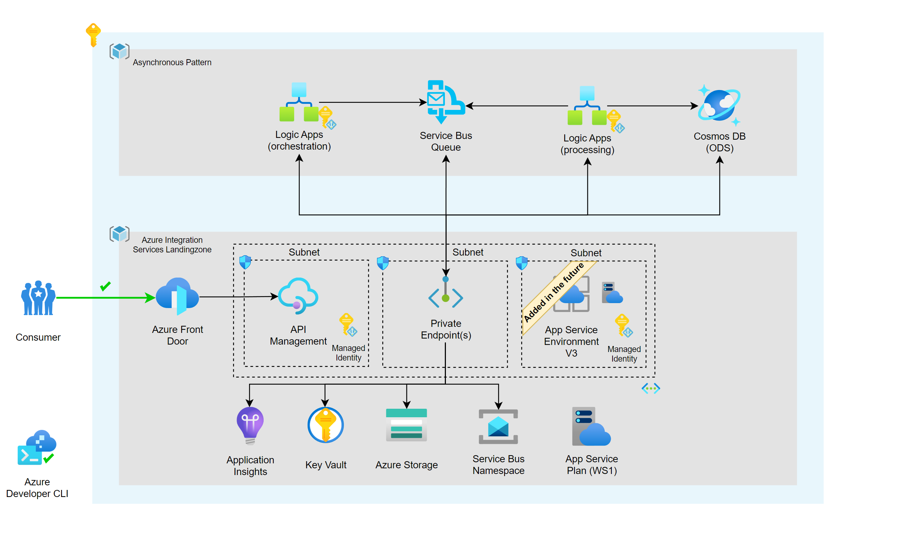

<!-- YAML front-matter schema: https://review.learn.microsoft.com/en-us/help/contribute/samples/process/onboarding?branch=main#supported-metadata-fields-for-readmemd -->

[](https://codespaces.new/Azure/azd-ais-async)
[](https://vscode.dev/redirect?url=vscode://ms-vscode-remote.remote-containers/cloneInVolume?url=https://github.com/Azure/azd-ais-async)

<!--
Available as template on:
[](https://aka.ms/awesome-azd)
`azd`
-->
# Deploy an Asynchronous Pattern to the azd-ais-lza with Azure Developer CLI

Deploy an Asynchronous Pattern to the [azd-ais-lza with](https://github.com/pascalvanderheiden/azd-ais-lza) Azure Developer CLI to demonstrate an automated deployment of an Integration Pattern to an Azure Integration Services Landingzone. The integration landingzone includes best practices for security, network isolation, monitoring, and more.

Based on the choices made during the Landingzone deployment (like deploying Azure Frontdoor, Application Service Environment v3, Azure Service Bus), the Asynchronous Pattern will be deployed to the Landingzone. The Asynchronous Pattern includes an Azure Logic App with multiple workflows, Azure Service Bus Queues, CosmosDB as an ODS, and APIs in Azure API Management.

## Key features

- **Infrastructure-as-code**: Bicep templates for provisioning and deploying the resources.
- **Secure Access Management**: Best practices and configurations for managing secure access to Azure Integration Services.
- **Monitoring**: Solutions for tracking and monitoring Azure Integration Services.
- **End-to-end sample**: Deployment of an Asynchronous Pattern from beginning to end.

## Architecture

### Azure Integration Services Landingzone Accelerator


### Asynchronous Pattern

Read more: [Architecture in detail](#architecture-in-detail)

## Assets

- Infrastructure-as-code (IaC) Bicep files under the `infra` folder that demonstrate how to provision resources and setup resource tagging for azd.
- A [dev container](https://containers.dev) configuration file under the `.devcontainer` directory that installs infrastructure tooling by default. This can be readily used to create cloud-hosted developer environments such as [GitHub Codespaces](https://aka.ms/codespaces) or a local environment via a [VSCode DevContainer](https://code.visualstudio.com/docs/devcontainers/containers).
- Continuous deployment workflows for CI providers such as GitHub Actions under the `.github` directory, and Azure Pipelines under the `.azdo` directory that work for most use-cases.

## Getting started

### Prerequisites

- [Azure Developer CLI](https://docs.microsoft.com/en-us/azure/developer/azure-developer-cli/)
- [Azure CLI](https://docs.microsoft.com/en-us/cli/azure/install-azure-cli)

### 1. Initialize a new `azd` environment

```shell
azd init -t pascalvanderheiden/azd-ais-async
```

If you already cloned this repository to your local machine or run from a Dev Container or GitHub Codespaces you can run the following command from the root folder.

```shell
azd init
```

It will prompt you to provide a name that will later be used in the name of the deployed resources. If you're not logged into Azure, it will also prompt you to first login.

```shell
azd auth login
```

### 2. Provision and deploy all the resources

```shell
azd up
```

It will prompt you to login, pick a subscription, and provide a location (like "eastus"). We've added extra conditional parameters to determine to which infrastructure services you want to deploy. For example, Azure Service Bus is an optional service that you can choose to deploy or not in the Landingzone. For this pattern, the Service Bus service is required. This pattern will not deploy an instance of Service Bus, but you'll need to have it deployed in the Landingzone. The same applies to the App Service Environment v3, if you have chosen to deploy Logic Apps to an isolated environment, this App Service Plan will be used. Otherwise, the Logic Apps will be deployed to the "public, but shielded off from the internet" App Service Plan.

```shell 

For more details on the deployed services, see [additional details](#additional-details) below.

The conditional parameters set in the `azd up` command are stored in the .azure\<name>\config.json file:

```json
{
  "infra": {
    "parameters": {
      "serviceBusNamespaceLza": "<service bus namespace name of the integration landingzone>>",
      "appServicePlanLza": "<app service plan name of the integration landingzone>>",
      "resourceGroupNameLza": "<resource group name of the integration landingzone>"
      "apiManagementNameLza": "<api management name of the integration landingzone>"
      "frontDoorNameLza": "<front door name of the integration landingzone>"
    }
  }
}
```

## Additional features

### CI/CD pipeline

This project includes a Github workflow and a Azure DevOps Pipeline for deploying the resources to Azure on every push to main. That workflow requires several Azure-related authentication secrets to be stored as Github action secrets. To set that up, run:

```shell
azd pipeline config
```

### Enable AZD support for ADE (Azure Development Environment)

You can configure `azd` to provision and deploy resources to your deployment environments using standard commands such as `azd up` or `azd provision`. When `platform.type` is set to devcenter, all `azd` remote environment state and provisioning uses dev center components. `azd` uses one of the infrastructure templates defined in your dev center catalog for resource provisioning. In this configuration, the infra folder in your local templates isn’t used.

```shell
 azd config set platform.type devcenter
```

### Monitoring

The deployed resources include a Log Analytics workspace with an Application Insights based dashboard to measure metrics like server response time and failed requests.


To open that dashboard, run this command once you've deployed:

```shell
azd monitor --overview
```

### Clean up

To clean up all the resources you've created and purge the soft-deletes, simply run:

```shell
azd down --purge --force
```

The resource group and all the resources will be deleted and you'll not be prompted.

### Testing

A [tests.http](tests.http) file with relevant tests you can perform is included, to check if your deployment is successful. You need the subcription key, created in API Management in order to test the API. The rest of the names / urls can be fetched from the azd env file here: .azure/<name>/.env or by using this command:

```shell
azd env get-values
```

You can find more information about how to create subscription keys [here](https://docs.microsoft.com/en-us/azure/api-management/api-management-howto-create-subscriptions#add-a-subscription-key-to-a-user).

### Build Status

After forking this repo, you can use this GitHub Action to enable CI/CD for your fork. Just adjust the README in your fork to point to your own GitHub repo.

| GitHub Action | Status |
| ----------- | ----------- |
| `azd` Deploy | [](https://github.com/Azure/azd-ais-async/actions/workflows/azure-dev.yml) |

## Additional Details

The following section examines different concepts that help tie in application and infrastructure.

### Architecture in detail

This repository illustrates how to setup the Azure Integration Services Landing Zone accelerator with Azure Developer CLI. The accelerator includes best practices for security, network isolation, monitoring, and more.

We've used the Azure Developer CLI Bicep Starter template to create this repository. With `azd` you can create a new repository with a fully functional CI/CD pipeline in minutes. You can find more information about `azd` [here](https://learn.microsoft.com/en-us/azure/developer/azure-developer-cli/).

One of the key points of `azd` templates is that we can implement best practices together with our solution when it comes to security, network isolation, monitoring, etc. Users are free to define their own best practices for their dev teams & organization, so all deployments are followed by the same standards.

The best practices we've followed for this architecture are: [Azure Integration Service Landingzone Accelerator](https://github.com/Azure/Integration-Services-Landing-Zone-Accelerator).

When it comes to security, there are recommendations mentioned for securing your Azure API Management instance in the accelerators above. For example, implementing OAuth authentication on the API Management instance. How to implement OAuth authentication on API Management (see [here](https://github.com/pascalvanderheiden/ais-apim-oauth-flow) repository).

We're also using [Azure Monitor Private Link Scope](https://learn.microsoft.com/en-us/azure/azure-monitor/logs/private-link-security#configure-access-to-your-resources). This allows us to define the boundaries of my monitoring network, and only allow traffic from within that network to my Log Analytics workspace. This is a great way to secure your monitoring network.

### Azure API Management

[Azure API Management](https://azure.microsoft.com/en-us/services/api-management/) is a fully managed service that enables customers to publish, secure, transform, maintain, and monitor APIs. It is a great way to expose your APIs to the outside world in a secure and manageable way.

### Managed identities

[Managed identities](https://learn.microsoft.com/en-us/azure/active-directory/managed-identities-azure-resources/overview) allows you to secure communication between services. This is done without having the need for you to manage any credentials.

### Application Insights

[Application Insights](https://azure.microsoft.com/en-us/services/monitor/) allows you to monitor your application. You can use this to monitor the performance of your application.

### Log Analytics

[Log Analytics](https://azure.microsoft.com/en-us/services/monitor/) allows you to collect and analyze telemetry data from your application. You can use this to monitor the performance of your application.

### Azure Service Bus

[Azure Service Bus](https://azure.microsoft.com/en-us/services/service-bus/) allows you to use a secure messaging service.

### Azure Front Door

[Azure Front Door](https://azure.microsoft.com/en-us/services/frontdoor/) allows you to use a secure global CDN.

### Azure App Service Environment v3

[Azure App Service Environment](https://azure.microsoft.com/en-us/services/app-service/environment/) allows you to use a secure and isolated environment for running your Logic App or Azure Function App.

### Azure Key Vault

[Azure Key Vault](https://azure.microsoft.com/en-us/services/key-vault/) allows you to store and manage your secrets in a secure way.

### Azure Storage

[Azure Storage](https://azure.microsoft.com/en-us/services/storage/) allows you to store your data in a secure way.

### Azure Cosmos DB

[Azure Cosmos DB](https://azure.microsoft.com/en-us/services/cosmos-db/) allows you to store your data in a secure way.

### Azure Logic Apps

[Azure Logic Apps](https://azure.microsoft.com/en-us/services/logic-apps/) allows you to automate your workflows.